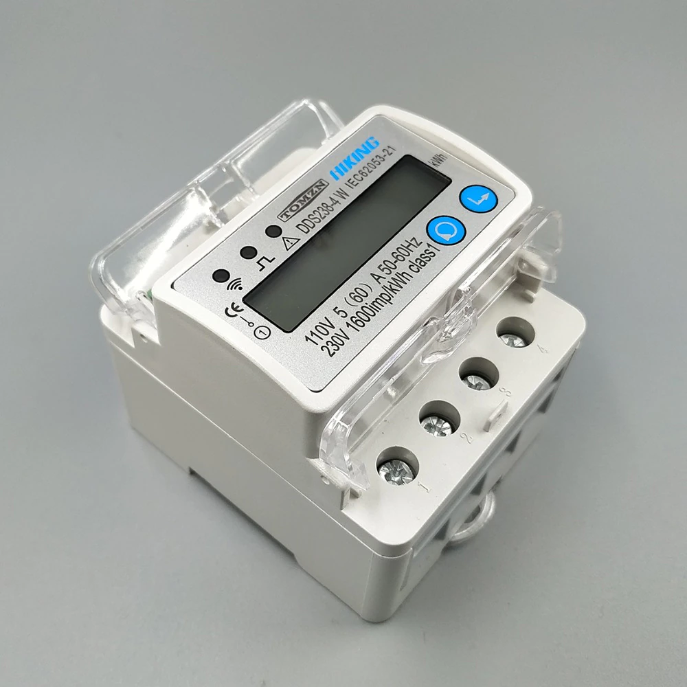
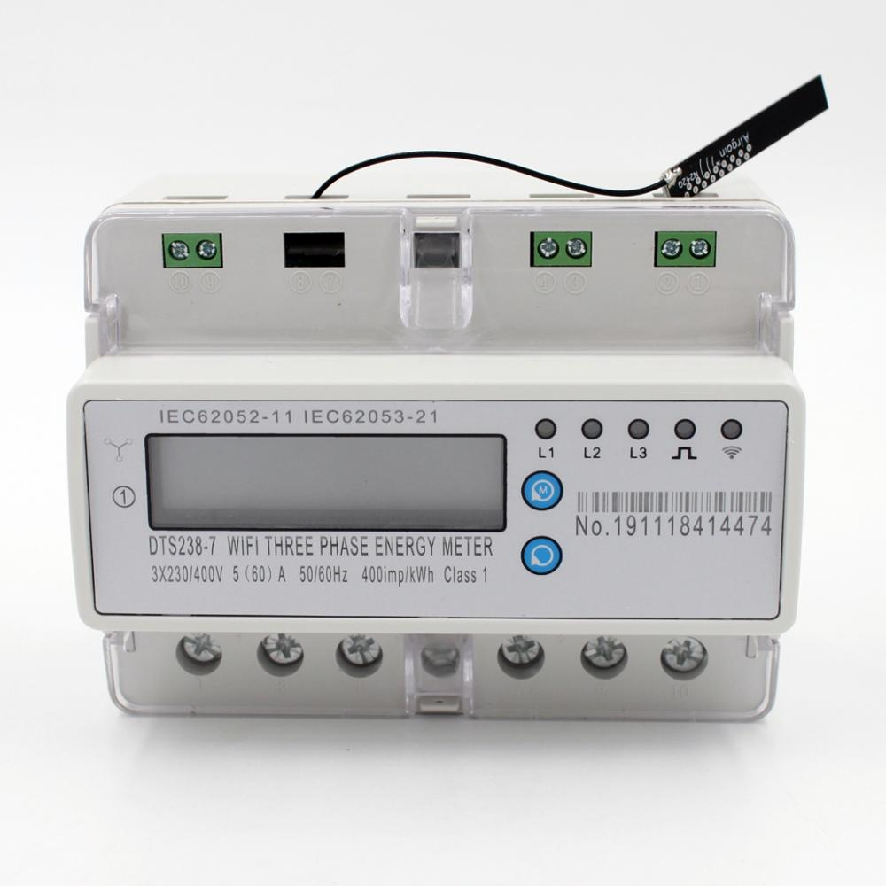

Hekr Serial Communication Protocol
===

## HIKING DDS238-4 W & DTS238-7 W Power Meters

- **Single phase (DDS238-4 W)**
  <details>
    <summary>Front Side Picture</summary>
    
  </details>

   - Purchase Link 1: https://aliexpress.com/item/1005001496686330.html
   - Purchase Link 2: https://aliexpress.com/item/1005004221786681.html
   - Purchase Link 3: https://aliexpress.com/item/1005003783545141.html

- **Triple phase (DTS238-7 W)**
  <details>
    <summary>Front Side Picture</summary>
    
  </details>

   - Purchase Link 1: https://aliexpress.com/item/4001233900800.html
   - Purchase Link 2: https://www.alibaba.com/product-detail/Smart-Wifi-Meter-DTS238-7-W_62266426106.html

The following configuration is for a single-phase power meter:

```yaml
# Substitutions used across power meter config imports
substitutions:
  friendly_name: Root Energy Meter

# This board is the closest to what the original is.
# Actual board type is WT8266-S2.
# For reference: http://docs.hekr.me/v4/%E7%A1%AC%E4%BB%B6%E5%BC%80%E5%8F%91/%E6%B0%A6%E6%B0%AA%E6%A8%A1%>
esp8266:
  board: esp_wroom_02
  restore_from_flash: true

# Disabling UART logging by default
logger:
  baud_rate: 0
  logs:
    sensor: INFO

# Enable web server (optionally)
web_server:
  port: 80

# Configuration of the UART bus for 9600 baud rate
uart:
  id: uart_bus
  tx_pin: TX
  rx_pin: RX
  baud_rate: 9600

# Load external components
external_components:
  - source:
      type: git
      url: https://github.com/alryaz/esphome-components
      ref: main
    components: [ hekr ]
    refresh: 1s

# Load external packages
packages:
  # Meta-package with WiFi, OTA and API configuration (basically, your own code).
  base: !include packages/base.yaml

  # Power meter configuration imports
  common: github://alryaz/esphome-components/components/hekr/packages/power_meter/common.yaml@main
  power_meter: github://alryaz/esphome-components/components/hekr/packages/power_meter/single_phase.yaml@main

# Enable integration
hekr:

```
